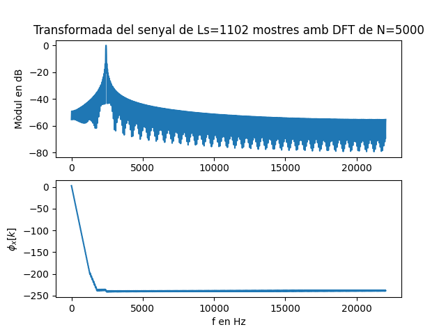

Primera tasca APA 2023: Anàlisi fitxer de so
============================================

## Nom i cognoms: Kirian Rodríguez Alonso


## Representació temporal i freqüencial de senyals d'àudio.

### Domini temporal

Per llegir, escriure i representar un fitxer en format `*.wav` en python podem fem servir els següents mòduls:

- Numpy:
```python
import numpy as np
```
- Matplotlib: 
```python
import matplotlib.pyplot as plt
```
- Soundfile:
```python
import soundfile as sf
```

Per **crear** i **guardar** a un fitxer un senyal sinusoidal de freqüència `fx Hz`, digitalitzat a `fm Hz`, de durada `T` segons i amplitud 
`A` fem:

```python
T= 2.5                               # Durada de T segons
fm=8000                              # Freqüència de mostratge en Hz
fx=440                               # Freqüència de la sinusoide
A=4                                  # Amplitud de la sinusoide
pi=np.pi                             # Valor del número pi
L = int(fm * T)                      # Nombre de mostres del senyal digital
Tm=1/fm                              # Període de mostratge
t=Tm*np.arange(L)                    # Vector amb els valors de la variable temporal, de 0 a T
x = A * np.cos(2 * pi * fx * t)      # Senyal sinusoidal
sf.write('so_exemple1.wav', x, fm)   # Escriptura del senyal a un fitxer en format wav
```

El resultat és un fitxer guardat al directori de treball i que es pot reproduir amb qualsevol reproductor d'àudio

Per **representar** gràficament 5 períodes de senyal fem:

```python
Tx=1/fx                                   # Període del senyal
Ls=int(fm*5*Tx)                           # Nombre de mostres corresponents a 5 períodes de la sinusoide

plt.figure(0)                             # Nova figura
plt.plot(t[0:Ls], x[0:Ls])                # Representació del senyal en funció del temps
plt.xlabel('t en segons')                 # Etiqueta eix temporal
plt.title('5 periodes de la sinusoide')   # Títol del gràfic
plt.show()                                # Visualització de l'objecte gràfic. 
```

El resultat del gràfic és:


> Nota: Si es treballa amb ipython, es pot escriure %matplotlib i no cal posar el plt.show() per veure gràfics

El senyal es pot **escoltar (reproduir)** directament des de python important un entorn de treball amb els dispositius de so, com per 
exemple `sounddevice`:

```python
import sounddevice as sd      # Importem el mòdul sounddevice per accedir a la tarja de so
sd.play(x, fm)                # Reproducció d'àudio
```

### Domini transformat

Domini transformat. Els senyals es poden analitzar en freqüència fent servir la Transformada Discreta de Fourier. 

La funció que incorpora el paquet `numpy` al submòdul `fft` és `fft`:

```python
from numpy.fft import fft     # Importem la funció fft
N=5000                        # Dimensió de la transformada discreta
X=fft(x[0 : Ls], N)           # Càlcul de la transformada de 5 períodes de la sinusoide
```

I podem representar el mòdul i la fase, en funció de la posició de cada valor amb:

```python
k=np.arange(N)                        # Vector amb els valors 0≤  k<N

plt.figure(1)                         # Nova figura
plt.subplot(211)                      # Espai per representar el mòdul
plt.plot(k,abs(X))                    # Representació del mòdul de la transformada
plt.title(f'Transformada del senyal de Ls={Ls} mostres amb DFT de N={N}')   # Etiqueta del títol
plt.ylabel('|X[k]|')                  # Etiqueta de mòdul
plt.subplot(212)                      # Espai per representar la fase
plt.plot(k,np.unwrap(np.angle(X)))    # Representació de la fase de la transformad, desenroscada
plt.xlabel('Index k')                 # Etiqueta de l'eix d'abscisses 
plt.ylabel('$\phi_x[k]$')             # Etiqueta de la fase en Latex
plt.show()                            # Per mostrar els grafics
```


-----------------------------------

# Proves i exercicis a fer i entregar


## 1. Reprodueix l'exemple fent servir diferents freqüències per la sinusoide. Al menys considera $f_x = 4$ kHz, a banda d'una freqüència pròpia en el marge audible. Comenta els resultats.
```python
T= 2.5                               
fm=8000                              
fx=4000                              
A=4                                 
pi=np.pi                             
L = int(fm * T)                      
Tm=1/fm                              
t=Tm*np.arange(L)                    
x = A * np.cos(2 * pi * fx * t)      
sf.write('Kirian-so_exemple1.wav', x, fm)

Tx=1/fx                                   
Ls=int(fm*5*Tx)   

plt.figure(0)                            
plt.plot(t[0:Ls], x[0:Ls])                
plt.xlabel('t en segons')                 
plt.title('Frequència = 4kHz. 5 periodes de la sinusoide')   
plt.show()   


```


```python
             
# Analisis en freqüència
N=5000                      
X=fft(x[0 : Ls], N)           

# Representació del mòdul i la fase
k=np.arange(N)                        
plt.figure(1)                         
plt.subplot(211)                     
plt.plot(k,abs(X))                    
plt.title(f'Transformada del senyal de Ls={Ls} mostres amb DFT de N={N}')   
plt.ylabel('|X[k]|')                  
plt.subplot(212)                      
plt.plot(k,np.unwrap(np.angle(X)))    
plt.xlabel('Index k')                
plt.ylabel('$\phi_x[k]$')             
plt.show()
```


```python

# Ara amb una freqüència de 440Hz

T= 2.5                              
fm=8000                            
fx=440                              
A=4                               
pi=np.pi                            
L = int(fm * T)                      
Tm=1/fm                              
t=Tm*np.arange(L)                    
x = A * np.cos(2 * pi * fx * t)     
sf.write('Kirian-so_fitxer2.wav', x, fm)   
Tx=1/fx                                  
Ls=int(fm*5*Tx)                          

plt.figure(2)                             
plt.plot(t[0:Ls], x[0:Ls])                
plt.xlabel('t en segons')                
plt.title('Frequència = 440Hz. 5 periodes de la sinusoide')   
plt.show()    

```


```python
          

# Analisis en freqüència
N=5000                      
X=fft(x[0 : Ls], N)           

# Representació del mòdul i la fase
k=np.arange(N) 

plt.figure(3)                         
plt.subplot(211)                     
plt.plot(k,abs(X))                    
plt.title(f'Transformada del senyal de Ls={Ls} mostres amb DFT de N={N}')   
plt.ylabel('|X[k]|')                  
plt.subplot(212)                      
plt.plot(k,np.unwrap(np.angle(X)))    
plt.xlabel('Index k')                
plt.ylabel('$\phi_x[k]$')             
plt.show()   

```


--------------------------
## 1r Cas
 En el cas del 4kHz podem veure que els 5 períodes duren 1ms amb una amplitud de 4.
 Podem observar que a més alta la freqüència, més aguda serà la senyal. 
 El numero de mostres es de 10, la transformada de la funció podem veure que es una sinc.
 La forma de la senyal es degut a que la frequencia de mostreig es aproximadament el doble de la frequencia de la sinusoide.


## 2n Cas
 En aquest segon cas(440Hz), hi ha 5 períodes de la sinusoide que duren 10ms i de amplitud 4. 
 El numero de mostres es de 90 en els 5 períodes. 
 La transformada ens mostra dos polsos amb un mòdul de 175.

#

# 2. Modifica el programa per considerar com a senyal a analitzar el senyal del fitxer wav que has creat (x_r, fm = sf.read('nom_fitxer.wav')).
``` python
x_r, fm = sf.read('Kirian-so_exemple1.wav')

Tm=1/fm                                   # Període del senyal
Ls=int(fm*5*Tx)                           # Nombre de mostres corresponents a 5 períodes de la sinusoide

t=Tm* np.arange(len(x_r))               
sf.write('Kirian-so_ex2.wav', x_r, fm) 


#Representació 5 periodes
fx=fm/2
Tx=1/fx                                   # Període del senyal
Ls=int(fm*5*Tx)                           # Nombre de mostres corresponents a 5 períodes de la sinusoide

plt.figure(4)                             
plt.plot(t[0:Ls], x_r[0:Ls])                
plt.xlabel('t en segons')              
plt.title('Ex2, 5 periodes de la sinusoide')   
plt.show() 

```


``` python

# Analisis en freqüència FFT
N=5000                      
X=fft(x[0 : Ls], N)           

# Representació del mòdul i la fase

k=np.arange(N)                        
plt.figure(5)                         
plt.subplot(211)                     
plt.plot(k,abs(X))                    
plt.title(f'Transformada del senyal de Ls={Ls} mostres amb DFT de N={N}')   
plt.ylabel('|X[k]|')                  
plt.subplot(212)                      
plt.plot(k,np.unwrap(np.angle(X)))    
plt.xlabel('Index k')                
plt.ylabel('$\phi_x[k]$')             
plt.show()   
```


### Explicació 
Utilitzo l'arxiu creat "Kirian-so_exemple1.wav" amb la freqüència de 4 kHz.
En emprar la mateixa freqüència significa que obtindrem els mateixos resultats una altra vegada.
#
#
# 3. Modifica el programa per representar el mòdul de la Transformada de Fourier en dB i l'eix d'abscisses en el marge de    $0$ a $f_m/2$ en Hz.

``` python
T= 2.5                               # Durada de T segons
fm=8000                              # Freqüència de mostratge en Hz
fx=440                               # Freqüència de la sinusoide
A=4                                  # Amplitud de la sinusoide
pi=np.pi                             # Valor del número pi
L = int(fm * T)                      # Nombre de mostres del senyal digital
Tm=1/fm                              # Període de mostratge
t=Tm*np.arange(L)                    # Vector amb els valors de la variable temporal, de 0 a T
x = A * np.cos(2 * pi * fx * t)      # Senyal sinusoidal
sf.write('Kirian-so_ex3.wav', x, fm)   # Escriptura del senyal a un fitxer en format wav
Tx=1/fx                                   
Ls=int(fm*Tx*5)                           

plt.figure(6)                             
plt.plot(t[0:Ls], x[0:Ls])               
plt.xlabel('t en segons')                 
plt.title('Ex3- 5 períodes')  
plt.show()   
```


```python
#Reproducció del so
sd.play(x, fm)                

# Analisis en freqüència FFT
N=5000                      
X=fft(x[0 : Ls], N)           

# Representació del mòdul i la fase

k=np.arange(N)  
dBX = 20*np.log10(np.abs(X)/max(np.abs(X)))
fk = k[0:N//2+1]*fm/N         #Calcul de la fk, pels valors de l'eix d'abscisses
plt.figure(7)
plt.subplot(211)   
plt.plot(fk,dBX[0:N//2+1])  # Representació del mòdul de la transformada en dB y de 0 a FK/2
plt.title(f'Transformada del senyal de Ls={L} mostres amb DFT de N={N}')   
plt.ylabel('Mòdul en dB')                  
plt.subplot(212)                      
plt.plot(fk,np.unwrap(np.angle(X[0:N//2+1])) )   
plt.xlabel('f en Hz')                
plt.ylabel('$\phi_x[k]$')              
plt.show() 
```


----

Comprova que la mesura de freqüència es correspon amb la freqüència de la sinusoide que has fet servir.
  
   - Utilitzant la formula de $f_o$ = $\frac{k}{n}$ $\cdot$ $fm$ podem confirmar que es corresponen.

-------
Com pots identificar l'amplitud de la sinusoide a partir de la representació de la transformada?
Comprova-ho amb el senyal generat.

   - L'amplitud és el valor màxim que té de valor 0dB, al normaliutzarlo és de valor 1.


#
#
# 4. Tria un fitxer d'àudio en format wav i mono (el pots aconseguir si en tens amb altres formats amb el programa Audacity). 
Llegeix el fitxer d'àudio i comprova:

- Freqüència de mostratge.
- Nombre de mostres de senyal.
- Tria un segment de senyal de 25ms i insereix una gráfica amb la seva evolució temporal.
- Representa la seva transformada en dB en funció de la freqüència, en el marge $0\le f\le f_m/2$.
- Quines son les freqüències més importants del segment triat?

```python

T= 0.025                               
data, fm =sf.read('luzbel44.wav')  
L = int(fm * T)                     
Tm=1/fm                            
t=Tm*np.arange(L)    

print('Fm:',fm) #44100Hz
print('Numero de mostres:',L) #1102 mostres

sf.write('Kirian-so_ex4.wav', data, fm)

#Gràfica
plt.figure(8)                          
plt.plot(t[0:L],data[0:L])              
plt.xlabel('t(s)')               
plt.title('Ex. 4')  
plt.show() 

```


```python

# Analisis en freqüència FFT
N=5000                      
X=fft(x[0 : L], N)           

# Representació del mòdul i la fase
k=np.arange(N)                                         
plt.figure(9)                         
dBX = 20*np.log10(np.abs(X)/max(np.abs(X)))
fk = k[0:N//2+1]*fm/N
plt.subplot(211)   
plt.plot(fk,dBX[0:N//2+1])  # Representació del mòdul de la transformada en dB y de 0 a FK/2


plt.title(f'Transformada del senyal de Ls={L} mostres amb DFT de N={N}')   
plt.ylabel('Mòdul en dB')                   
plt.subplot(212)                      
plt.plot(fk,np.unwrap(np.angle(X[0:N//2+1])) )   
plt.xlabel('f en Hz')                
plt.ylabel('$\phi_x[k]$')          
plt.show() 

```


## Quines son les freqüències més importants del segment triat?
En l'arxiu de luzbel44.wav les freqüències més importants serien de 0Hz fins aproximadament uns 2.5 kHz.
#
#

Entrega
-------

- L'alumne ha de respondre a totes les qüestions formulades en aquest mateix fitxer, README.md.
    - El format del fitxer es l'anomenat *Markdown* que permet generar textos amb capacitats gràfiques (com ara *cursiva*, **negreta**,
      fòrmules matemàtiques, taules, etc.), sense perdre la llegibilitat en mode text.
    - Disposa d'una petita introducció a llenguatge de Markdown al fitxer `MARKDOWN.md`.
- El repositori GitHub ha d'incloure un fitxer amb tot el codi necesari per respondre les qüestions i dibuixar les gràfiques.
- El nom del fitxer o fitxers amb el codi ha de començar amb les inicials de l'alumne (per exemple, `fvp_codi.py`).
- Recordéu ficar el el vostre nom complet a l'inici del fitxer o fitxers amb el codi i d'emplar el camp `Nom i cognoms` a dalt de tot
  d'aquest fitxer, README.md.
